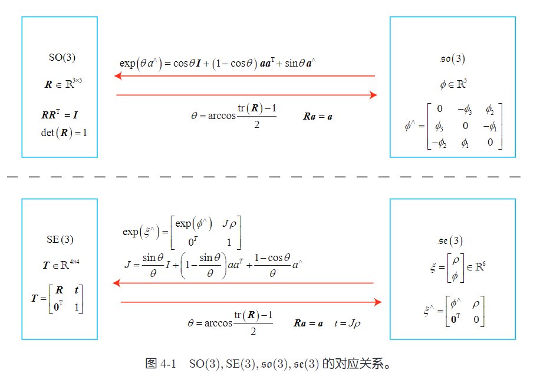
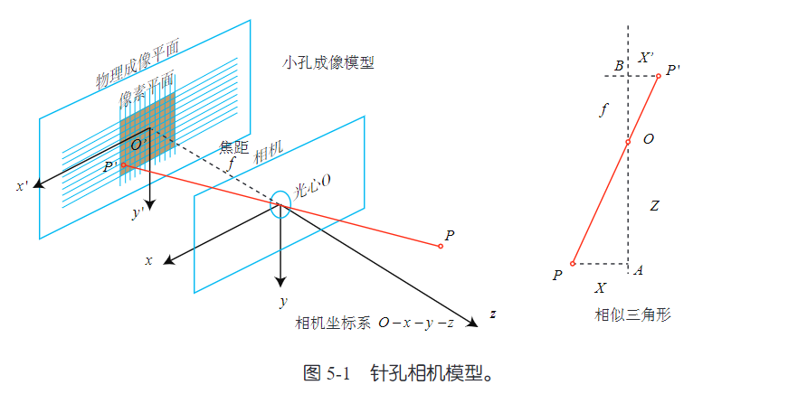
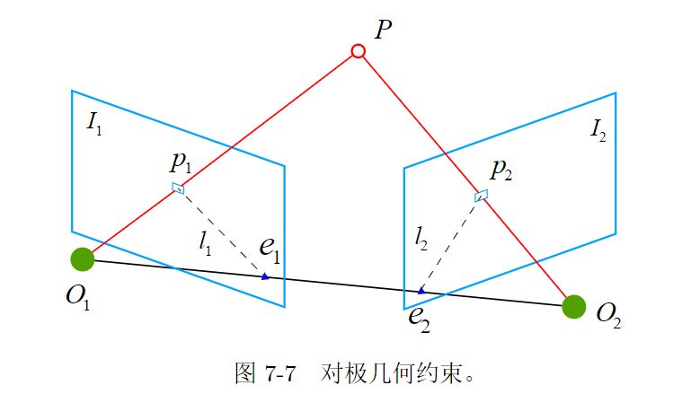

# slamNotes/images

这个目录存放 `slamNotes/` 下各篇笔记使用的图片资源。

## 当前图片

- `4_1.png`
- `5_1.png`
- `7-7.png`
- `happy.gif`
- `uestc1.png`
- `uestc2.png`

## 资源台账

| 文件 | 当前用途 | 处理建议 |
| --- | --- | --- |
| `4_1.png` | `slam学习笔记.md` 中使用 | 暂时保留在公共图片目录 |
| `5_1.png` | `slam学习笔记.md` 中使用 | 暂时保留在公共图片目录 |
| `7-7.png` | `slam学习笔记.md` 中使用 | 暂时保留在公共图片目录 |
| `happy.gif` | 当前作为通用演示图保留 | 若后续明确归属，可迁移到专题目录 |
| `uestc1.png` | 当前作为通用素材保留 | 若后续明确归属，可迁移到专题目录 |
| `uestc2.png` | 当前作为通用素材保留 | 若后续明确归属，可迁移到专题目录 |

## 使用说明

- 这些图片主要服务于 `slamNotes/` 里的文档引用
- 如果后续能明确某张图只属于某一个专题，优先就近移动到对应专题目录
- 暂时保留在这里，避免现有 Markdown 图片链接失效
- 根目录里的 `image.png` 当前由 `use_g2o.md` 引用，后续如果整理图片规则，可以一起决定是否迁移

## 预览

`4_1.png`

`5_1.png`

`7-7.png`

`happy.gif`

`uestc1.png`

`uestc2.png`

