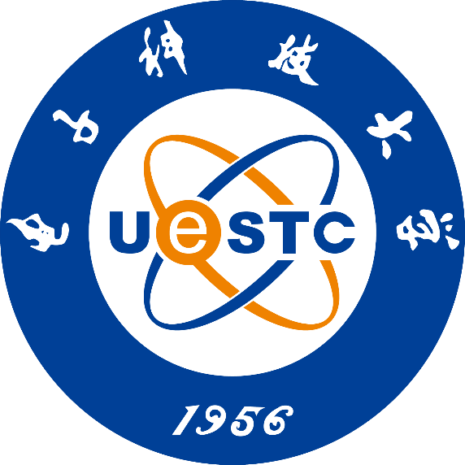

# 面向低纹理场景的室内机器人鲁棒定位系统研究

## 四个一
* 一个对标系统（OpenVins）
* 一套代码（OpenVins+GMS+MILD）
* 一个文档（。。。）
* 一个系统/论文(论文)


## 目录
- [摘要](#摘要)
- [ABSTRACT](#ABSTRACT)
- [研究背景](#研究背景)
- [GMS算法的改进和优化](#GMS算法的改进和优化)
- [特征置信度的优化](#特征置信度的优化)
- [重复纹理的回环检测](#重复纹理的回环检测)
- [系统和实验](#系统和实验) 
- [总结和展望](#总结和展望)
- [致谢](#致谢)

<div align=center>

</div>


<div align=center>

</div>


-----
<div align=center></div>
-----

]#pic_center)

-----
<p></p>

-----

<!-- <div align=center> -->

## 摘要
```
论文研究内容

关键词：视觉SLAM  低纹理场景 卡尔曼滤波 简介匹配策略 重复纹理 回环检测

```

## ABSTRACT

```
something about this paper

Keywords: thing1, thing2, thing3
```
## 研究背景

<div align="right">
    <b><a href="#目录">↥ Back To Top</a></b>
</div>


## GMS算法的改进和优化
### 参考论文
```
[1] Geneva P, Eckenhoff K, Lee W, et al. Openvins: A research platform for visual-inertial estimation[C]//2020 IEEE International Conference on Robotics and Automation (ICRA). IEEE, 2020: 4666-4672.
[2] Bian J W, Lin W Y, Matsushita Y, et al. Gms: Grid-based motion statistics for fast, ultra-robust feature correspondence[C]//Proceedings of the IEEE conference on computer vision and pattern recognition. 2017: 4181-4190.
```
### 理论推导

<div align="right">
    <b><a href="#目录">↥ Back To Top</a></b>
</div>


## 特征置信度的优化
### 参考论文
```

```

### 理论推导

<div align="right">
    <b><a href="#目录">↥ Back To Top</a></b>
</div>


## 重复纹理的回环检测

### 参考论文

```
[1] Han L, Fang L. MILD: Multi-index hashing for loop closure detection[J]. arXiv preprint arXiv:1702.08780, 2017.

[2] Han L, Zhou G, Xu L, et al. Beyond SIFT using binary features in loop closure detection[C]//2017 IEEE/RSJ International Conference on Intelligent Robots and Systems (IROS). IEEE, 2017: 4057-4063.

[3] Jégou H, Douze M, Schmid C. On the burstiness of visual elements[C]//2009 IEEE conference on computer vision and pattern recognition. IEEE, 2009: 1169-1176.


```

文章揭示了图像集中存在大量多次出现的视觉元素，即重复模式。这样视觉元素会严重影响图像检索时的相似度计算，所以需要除去burstiness元素，文中提出了三种方法：

* 移去多次特征点匹配；
* 抑制图像内burstiness词的匹配得分；
* 抑制图像间burstiness词的匹配得分。
### 理论推导

<div align="right">
    <b><a href="#目录">↥ Back To Top</a></b>
</div>


## 系统和实验

```
介绍系统
前端
后端
回环检测
实验结果
匹配效果对比
定位精度对比
回环准确率对比


```
<div align="right">
    <b><a href="#目录">↥ Back To Top</a></b>
</div>


## 总结和展望

```
总结自己的工作
有哪些优点，
有哪些不足
展望未来可能的研究

```
<div align="right">
    <b><a href="#目录">↥ Back To Top</a></b>
</div>


## 致谢
```
感叹时光飞逝
感谢someone1
感谢someone2
感谢someone3
感谢someone4
最后，。。。
```
<div align="right">
    <b><a href="#目录">↥ Back To Top</a></b>
</div>


