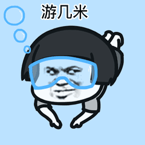

# 体重管理

## 目录
- [体重记录](#体重记录)
- [运动记录](#运动记录)
## 体重记录

单位：kg
### 2022

| 日期 | 李琦 | 钟志超 |
| :---: | :---: |  :---: | 
|6/13|75.05| 87| 
|6/15|75.05| ？| 
|7/16|75.05| ？| 
    

    <b><a href="#目录">↥ Back To Top</a></b>

### 2023

    <b><a href="#目录">↥ Back To Top</a></b>

## 运动记录

### 2022

  

| 日期 | 李琦 | 钟志超 |
| :---: | :---: |  :---: | 
|6/13|游泳| 游泳| 
|6/15|乒乓球| ？| 
|6/16|游泳| ？|
|6/23|游泳| 游泳| 
|6/28|游泳| 游泳| 
|7/02|游泳| ?| 
|7/07|游泳| ?| 
|7/11|游泳|游泳| 
|7/14|游泳|游泳| 
|7/16|游泳|游泳| 
|7/20|游泳|游泳|     
|7/21|游泳|游泳|
|7/23（剩87次）|游泳|游泳|     
|7/25|游泳|游泳|     
|7/28|游泳|游泳|    
|8/02|游泳|?|     

    <b><a href="#目录">↥ Back To Top</a></b>

### 2023

    <b><a href="#目录">↥ Back To Top</a></b>

