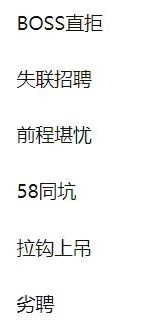

## 面经分享
## 找工作是真的难
 <div align=center>

</div>

* [笔试总结](牛客网刷题笔记/笔试总结.md)  
有些公司喜欢问八股文，总结的word在这里，自行下载。
* [八股文总结](https://docs.google.com/document/d/17r0LKghSM_9Eom2j8PJkyRhCHTKZoG89/edit?usp=sharing&ouid=100339261727029428476&rtpof=true&sd=true)

<!-- <p align="center">
    <a href="#才昌照">
        
    </a>
</p> -->

## 目录
- [公司官网](https://docs.qq.com/sheet/DZGFhVXpxdXViSVZC?tab=BB08J2&u=664f877c73e74560b8e309ae0920a36a)
- [智力题总结](牛客网刷题笔记/智力题总结.md)
- [李某](#李某)
- [杜凯](#杜凯)
- [李金洋](#李金洋)
- [才昌照](#才昌照)
- [周林峰](#周林峰)
- [王轶](#王轶)

## 反问环节
<details>
<summary><b>点击查看</b></summary>
    
```
首先分为技术面试官和HR两个角色出发：

反问技术面试官，可以问：

1、自己所应聘的部门有多少人？进去后是由谁负责带？
基本上根据这个部门员工的人数，你就可以大致了解他们的实力和规模，甚至是预测出他们这个部门目前处于一个什么样的水平和状态。
2、贵公司就前端而言所用到的技术栈？
看自己掌握的技术是否与公司所用的技术是否匹配，并且可以看出自己与工作中所需要技能的差距。
3、贵公司的培训项目是什么样的呢？
4、这次面试多久可以出结果？是否还有下一轮？
5、学习建议类
（如果面试的时候对自己的技术面很没底的话，这个时候你可以问一问别人关于学习前端的一些经验，一般面试官都很乐于告诉你的）
6、您希望我们实习生身上具有什么样的特质呢？
（这个是看令人心动的offer上get到的问题，个人觉得很好）
7、您面试到现在，看了这么多候选人，您觉得我相对于这个岗位，还有哪些差距需要改善？

反问HR，可以问：

1、公司的公司氛围、团队建设是怎样子的？
2、这个岗位出差、加班多吗？
3、新人有培训吗？
4、公司的晋升机制是什么样子的呢？
5、公司有餐补、房补、交通补助之类的吗？
6、当面试官问你的薪资要求时，你可以先问一下公司的薪酬体系
7、您认为考核这个岗位员工的最重要指标有哪些？
8、您觉得这个团队的氛围怎么样？
```
</details>


## 李某


### tplink
<details>
<summary><b>点击查看</b></summary>
    
* 笔试


```
1.内存越界
2.最大连续子数组乘积
3.链表中环的入口

```

* 一面


```
1.排序算法有哪些
2.快排的原理和时间复杂度
3.平衡二叉树
4.中序遍历
5.先序、中序、后序遍历的应用场合
6.对多态的理解
7.两个栈实现一个队列
8.TCP是什么，是否是可靠传输，如何保证可靠传输
9.如何实现拥塞控制


```

* 二面
```
自我介绍
面试官你好，我是李琦，来自四川达州。
就读于电子科技大学机器人研究中心，目前
研二，研究方向是视觉SLAM，就是基于视觉
的机器人同时定位与建图算法。平时主要使用的
语言是C++，对linux操作系统和机器人操作系统
Ros都很熟悉。我的项目经历主要开发扫地机器人
的带回环检测功能的同时定位与建图算法。主要负责
给系统移植回环检测模块，传感器的标定（包括相机
的标定，IMU的标定，相机和IMU的联合标定）。
以及解决算法在实际应用场景中由于特征稀疏，光照变化，
算力限制等带来的问题。
在竞赛方面，我参加了电子科技大学和长虹联合实验室
举办的扫地机器人创新方案设计比赛，获得一等奖，被
长虹公司采纳，预计很快该方案的产品就会在市场上
销售。我还参加了今年的华为软件精英挑战赛，担任队长，
获得成渝赛区32强，并在复赛中获得15名，初赛和复赛的
代码都开源在github。还参加了中兴举办的中兴捧月算法
个人赛，成功进入复赛，两个阶段的代码也开源在github
上面。
我的自我评价就是，喜欢钻研技术和分享技术。

项目相关

1.若干根非均匀的绳子，每根绳子烧完的时间是1个小时。如何得到15分钟的时间？
一根绳子两端点燃得到30分钟，另一根绳子先点燃，然后在30分钟时点燃另一端，得到15分钟。
2.进程的状态，各个状态之间的转换及条件。
3.浏览器输入网址后，发生的全过程和各种协议（DNS,TCP,HTTP）
4.安全的http(https),HTTPS是计算机网络进行安全通信的传输协议,加密（SSL）
5.对哈希表的理解，避免冲突的算法有哪些。
6.malloc，以及使用后是否立即分配内存。
7.用户态和内核态


```


* 三面


```
没有自我介绍
问一些项目相关的问题
问我有什么想问的


```

* 座谈会


```
试用期4个月 90%薪资
四个月年终奖
第一年年终奖根据转正后折算
社保 
深圳 一档（深圳户口10%） 二档（8%）   公司25%
成都 个人10% 公司25%


公积金
各人和公司各5%（成都交在高新区）

工作时间和休假

```
</details>
 
### 哲库

<details>
<summary><b>点击查看</b></summary>
    
* 一面

```
先自我介绍
然后问项目
然后c++相关

1.多态
2.虚拟地址和物理地址
3.用户态和内核态
4.进程间通信
5.虚函数和纯虚函数
6.各种排序算法和时间复杂度
7.智能指针有哪些，并介绍
8.指针和引用的区别
9.别名的几种方式（引用，#define typedef using）

编程：
1.二叉树的最小深度
2.最长连续序列
```

</details>
<div align="right">
    <b><a href="#目录">↥ Back To Top</a></b>
</div>


## 杜凯

### tplink

<details>
<summary><b>点击查看</b></summary>
    
* 二面

```
1.项目相关 硬件怎样实现，软硬件平台

2.全局变量和局部变量的区别及应用场景

3.tcp和udp的区别

4.堆和栈是什么，那些数据用到了堆和栈，malloc用到了堆还是栈？

5.链表和数组有哪些区别，哪些数据用到了，应用场景

6.走100级阶梯有多少种走法，实现方式，我说了用递归实现，他又问如果走1000级，
10000级还能用递归实现吗，考虑到递归可能爆内存我说了要不用动态规划来做吧，
然后他就又问为什么不用递归，有哪些缺点。
```

* 三面

```
1.项目相关，展开将

2.成绩

3.数组和链表异同

4.投软件开发嵌入式方向岗位，有准备学习什么内容码？

5.兴趣爱好
```
</details>

### 字节

<details>
<summary><b>点击查看</b></summary>
    
* 一面

```
1.项目相关，问的挺久挺深的，细节描述一个项目
2.过拟合和欠拟合，概念（因为我开始把这两个概念说错了，后来纠正回来），数据量和模型参数的关
系，怎样才能有最佳的训练效果
3.避免过拟合的方式：正则化，数据增强，dropout
4.dropout的作用及原理，为什么能有避免过拟合作用；对于训练过程和预测过程，dropout的问题有哪些，
dropout的随机节点选取会不会导致预测结果的随机性，如果会的话，怎样解决？如果预测过程去掉
dropout，会对预测结果有哪些影响？答案从影响数据分布的角度出发。
5.评价指标的计算。公式我有些忘了，没答好，会给具体的数据示例让你算，没算出来。指标如，
presion,recall,f1,为什么会有f1 这个指标。各个指标具体怎么算。除了这些指标还有哪些指标。AUC 和roc
曲线，我说了我觉得这两个指标不适用我的场景，他让我了解一下这两个指标的适用场景。
6.损失函数有哪些，公式写一下。我说了交叉熵和mse，写了交叉熵的公式。
7.数组和链表的区别，以及为什么会有这些区别。
8.python的gil锁，以及多进程和多线程的区别及适用场景
9.算法题：【1，3，5】，【2，4，6】有序数组合并
```


</details>
<div align="right">
    <b><a href="#目录">↥ Back To Top</a></b>
</div>


## 李金洋

### tplink

<details>
<summary><b>点击查看</b></summary>    
    
* 一面

```
1.散列表
2.死锁
3.进程间通信
4.TCP，UDP
5.虚函数
6.引用和指针

```

* 二面

```

项目相关

1.指针和引用
2.哈希表
3.兴趣和优缺点

```
</details>

<div align="right">
    <b><a href="#目录">↥ Back To Top</a></b>
</div>


## 才昌照

### 28所
<details>
<summary><b>点击查看</b></summary>
    
* 一面(电话面试偷袭)

```
1.介绍下自己项目，更新了什么
2.引用和指针的区别
3.浅拷贝和深拷贝
4.C++面向对象三个特性
5.介绍下封装继承多态
6.多态实现方式
7.动态链接的2种方式
8.内存分配方式
9.map底层实现
10.知道什么排序
11.堆排序简短介绍

```

</details>


<div align="right">
    <b><a href="#目录">↥ Back To Top</a></b>
</div>

## 周林峰

### 28所

<details>
<summary><b>点击查看</b></summary>
    
* 一面（电话面试）

```

1.自我介绍，说了项目之类的
2.问了工作城市意向，专业课学的什么
3.问了python有哪些数据类型（因为项目用python写的）
4.问了数据结构的东西，双向链表和链表区别，给两个双向链表，从某个节点后数据相同，找到这个相同开始的节点。
5.问了红黑树、平衡二叉树、二叉树用数组存储的话父节点和子节点的索引关系
6.栈和队列，还有他们的应用场景
7.了解哪些设计模式，他们的使用原因
8.知道哪些排序方法，说出熟悉的排序方法思路
9.冒泡排序的时间和空间复杂度，是不是稳定的
10.哪些排序是不稳定的，答了希尔排序，然后问了希尔排序怎么实现
11.线程进程区别，通信方法，线程锁，线程怎么创建的
```
</details>

<div align="right">
    <b><a href="#目录">↥ Back To Top</a></b>
</div>


## 王轶

### 联发科

<details>
<summary><b>点击查看</b></summary>
    
* 一面

```

1.	项目介绍
2.	为什么投递联发科
3.	你认为你哪个部分学的好（计算机网络等）
4.	拥塞控制详细说说
5.	里面的快恢复详细说说
6.	虚拟地址可以一样吗
7.	只知道虚拟地址怎么找到内存
8.	内存管理里面页表页目录的过程
9.	操作系统功能调用有哪些
10.	操作系统的中断过程
11.	操作系统的中断再来个中断怎么办，怎么避免

```
</details>

<div align="right">
    <b><a href="#目录">↥ Back To Top</a></b>
</div>
